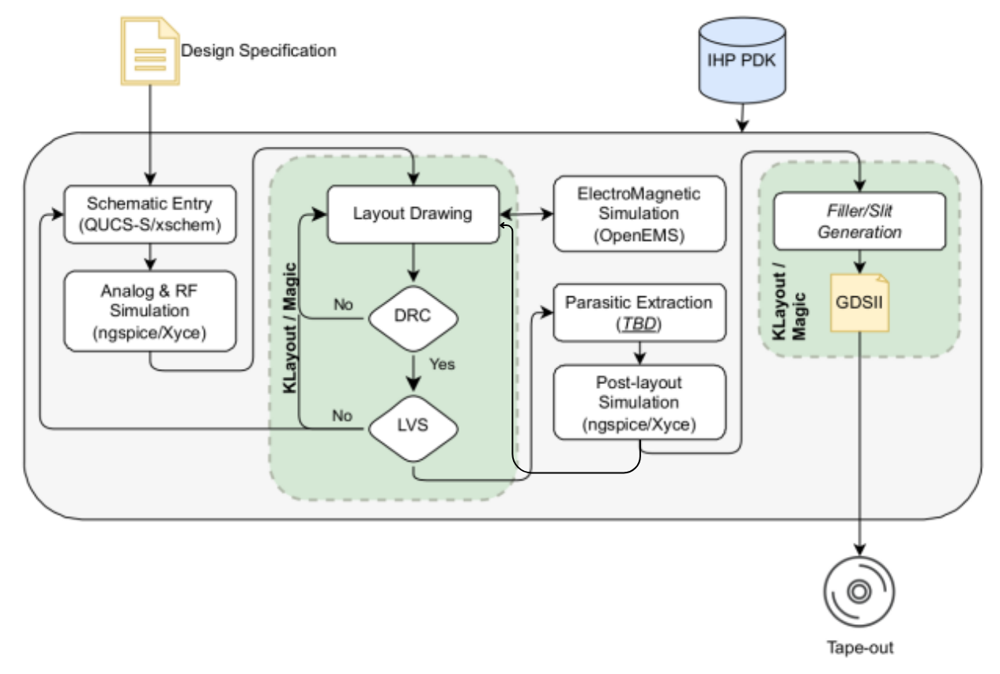

<p align="center">
  
  
</p>

# PSESI — Conception d'un OTA CMOS dans un flot open source
 
M1 SESI · Sorbonne Université · 2025–2026  
Rabab Boudih · Encadré par Dimitri Galayko
 
---
 
## C'est quoi ce projet ?
 
L'idée de départ était de voir si on peut concevoir un circuit intégré analogique de A à Z sans aucun outil propriétaire. Pas de Cadence, pas de licence industrielle — juste des outils open source et un PDK public.
 
Pour valider ça, on a conçu un OTA à deux étages compensé de Miller en technologie IHP SG13G2 BiCMOS 130nm, en passant par toutes les étapes du flot réel : schéma, simulation, layout, DRC, LVS, extraction des parasites et simulation post-layout.
 
---
 
## Le flot de conception


 
---
 
## Outils utilisés
 
| Outil | Rôle |
|-------|------|
| Xschem | Saisie du schéma + génération netlist |
| Ngspice | Simulations électriques |
| KLayout 0.30.2 | Layout + DRC + LVS |
| Magic 8.3.637 | Extraction des parasites (PEX) |
| OpenVAF | Compilation des modèles Verilog-A → .osdi |
 
PDK : [IHP-Open-PDK SG13G2](https://github.com/IHP-GmbH/IHP-Open-PDK)
 
---
 
## Spécifications et résultats
 
| Paramètre | Cible | Obtenu |
|-----------|-------|--------|
| VDD | 1.2 V | 1.2 V |
| Gain DC | ≥ 60 dB | ~55 dB |
| GBW | ≥ 100 MHz | ~80 MHz |
| Marge de phase | > 60° | ~60° |
| Vout au repos | VDD/2 | 0.607 V |
 
---
 
## Structure du dépôt
 
```
PSESI/
├── OTA.sch                        # Schéma de l'OTA (Xschem)
├── OTA.sym                        # Symbole de l'OTA
├── tb_layout.sch                  # Testbench de l'OTA et du post-layout
├── TOP.ext                        # Netlist extraite par Magic
├── TOP.spice                      # Fichier SPICE généré par Magic
├── layout.gds                     # Layout complet (KLayout)
├── nmos.ext / nmos$1.ext ...      # Fichiers d'extraction Magic par composant
├── pmos$1.ext ...                 # Fichiers d'extraction Magic par composant
├── xschemrc                       # Config Xschem locale (lien vers le PDK)
├── drc_run_TOP/                   # Rapports DRC
│   ├── drc_run_*.log
│   ├── layout_TOP_full.lyrdb
│   ├── layout_TOP_main.log
│   └── layout_TOP_sg13g2_maximal.log
├── lvs_run_TOP_.../               # Rapports LVS
│   ├── layout.log
│   ├── layout.lvsdb
│   ├── layout_extracted.cir
│   └── lvs_run_*.log
└── simulations/                   # Données de simulation
    ├── OTA.spice                  # Netlist de simulation
    ├── tb_layout.spice            # Netlist testbench post-layout
    ├── tb_layout.raw              # Données brutes de simulation
    └── tb_layout.save             # Fichier de sauvegarde Ngspice
```
 
---
 
## Configuration de l'environnement
 
Tout est compilé depuis les sources et lié manuellement au PDK. Variables à ajouter dans le `.bashrc` :
 
```bash
export PDK_ROOT=$HOME/ihp-pdk/IHP-Open-PDK
export PDK=ihp-sg13g2
 
export XSCHEM_USER_LIBRARY_PATH="$PDK_ROOT/$PDK/libs.tech/xschem"
ln -s $PDK_ROOT/ihp-sg13g2/libs.tech/xschem/xschemrc xschemrc
 
ln -s $PDK_ROOT/ihp-sg13g2/libs.tech/ngspice/.spiceinit .spiceinit
 
export KLAYOUT_PATH="$HOME/.klayout:$PDK_ROOT/$PDK/libs.tech/klayout"
export KLAYOUT_HOME=$HOME/.klayout
 
alias magic="magic -rcfile $PDK_ROOT/$PDK/libs.tech/magic/ihp-sg13g2.magicrc"
```
 
> Ngspice doit être compilé avec `--enable-osdi` pour charger les modèles générés par OpenVAF.
 
---

## Rapport

Le rapport complet est disponible [ici](PSESI_rapport.pdf).

 ---
 
## Références
 
- B. Razavi, Design of Analog CMOS Integrated Circuits, McGraw-Hill, 2001
- R. J. Baker, CMOS: Circuit Design, Layout, and Simulation, Wiley-IEEE Press, 2010
- [IHP-Open-PDK — GitHub](https://github.com/IHP-GmbH/IHP-Open-PDK)
