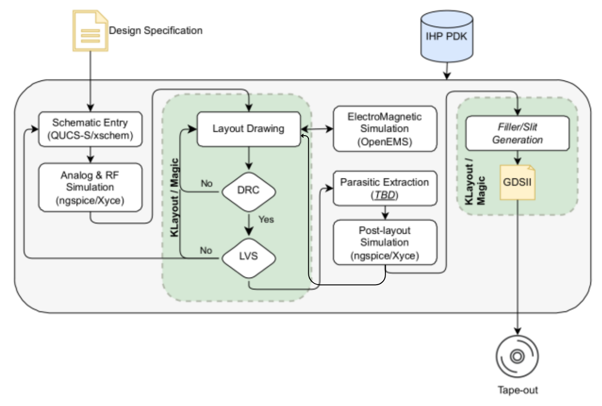
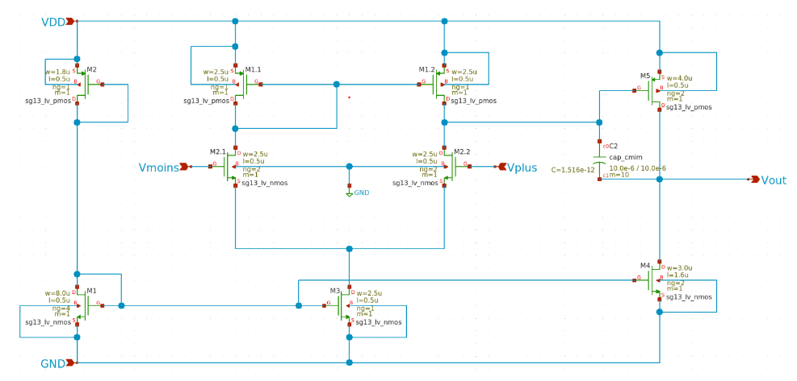
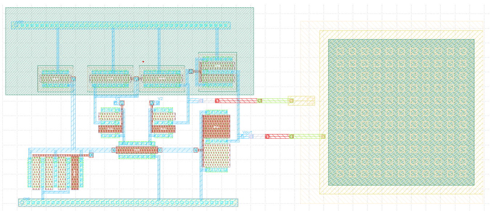
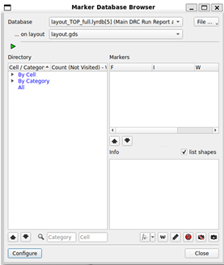
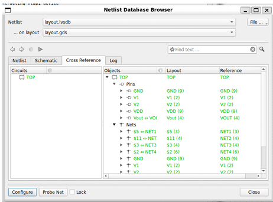

<p align="center">
  
  
</p>

# PSESI — Conception d'un OTA CMOS dans un flot open source
 
M1 SESI · Sorbonne Université · 2025–2026  
Rabab Boudih · Encadré par Dimitri Galayko
 
---
 
## Présentation

Ce projet porte sur la conception d’un amplificateur de transconductance opérationnel (OTA) CMOS à deux étages avec compensation de Miller, en technologie IHP SG13G2 BiCMOS 130 nm.

L’objectif était de mettre en place et d’utiliser un flot de conception entièrement open source, depuis la conception du schéma jusqu’à la simulation post-layout.

Le projet m’a permis de travailler sur les différentes étapes d’un flot de conception de circuit intégré :
 
schéma → simulation → layout → DRC → LVS → extraction des parasites → simulation post-layout


 
---

## Objectifs

- Prendre en main le PDK open source IHP SG13G2
- Mettre en place un environnement de conception basé sur des outils open source
- Concevoir et simuler un OTA CMOS à deux étages
- Réaliser son layout
- Vérifier le layout avec les règles de fabrication (DRC)
- Vérifier la correspondance entre le schéma et le layout (LVS)
- Extraire les résistances et capacités parasites
- Comparer les performances avant et après layout

---

## Outils utilisés
 
| Outil | Rôle |
|-------|------|
| Xschem | Saisie du schéma + génération netlist |
| Ngspice | Simulations électriques |
| KLayout 0.30.2 | Réalisation du layout, DRC + LVS |
| Magic 8.3.637 | Extraction des parasites (PEX) |
| OpenVAF | Compilation des modèles Verilog-A → .osdi |
 
PDK : [IHP-Open-PDK SG13G2](https://github.com/IHP-GmbH/IHP-Open-PDK)
 
---

## Conception de l’OTA

L’OTA est constitué de deux étages principaux.

Le premier étage utilise une paire différentielle avec une charge miroir de courant. Il permet de convertir la différence de tension entre les deux entrées en courant.

Le second étage est un amplificateur à source commune permettant d'obtenir la tension de sortie.

Une capacité de compensation de Miller est utilisée pour améliorer la stabilité du circuit.

Le circuit de polarisation génère directement la tension de polarisation à partir de l’alimentation.


---

## Simulation

Après la conception du schéma, plusieurs simulations ont été réalisées sous Ngspice afin de vérifier le fonctionnement du circuit.

Le point de fonctionnement obtenu donne une tension de sortie d'environ 0,607 V pour une alimentation de 1,2 V, proche de la moitié de l'alimentation.


La simulation fréquentielle donne un gain basse fréquence d'environ 55 dB et une fréquence de coupure d’environ 80kHz.


--- 

## Layout

Une fois le schéma validé, le layout de l’OTA a été réalisé sous KLayout.

Les transistors et les interconnexions ont été placés manuellement en respectant les règles de dessin du PDK. Une attention particulière a été portée à la symétrie des branches différentielles afin de limiter les effets de mismatch.


---

## Vérification du layout

Le layout a été vérifié avec les outils du PDK :

- **DRC (Design Rule Check)** : validé sans erreurs
- **LVS (Layout Versus Schematic)** : validé





---

## Extraction des parasites et simulation post-layout

Après validation du layout, les résistances et capacités parasites introduites par les interconnexions ont été extraites avec Magic.

Le circuit extrait a ensuite été simulé sous Ngspice afin de comparer son comportement avec celui obtenu avant le layout.

La comparaison pré-layout / post-layout montre un comportement très proche dans la bande de fonctionnement étudiée. Les différences deviennent principalement visibles aux très hautes fréquences.


## Résultats principaux
 
| Paramètre | Obtenu |
|-----------|--------|
| VDD | 1.2 V |
| Vout au repos | 0.607 V |
| Gain DC | ~55 dB |
| Fc | ~80 KHz |
| Marge de phase | ~60° |

 
---

## Ce que ce projet m’a permis de développer

-Conception de circuits analogiques CMOS
-Simulation électrique avec SPICE
-Dimensionnement et compréhension des transistors MOS
-Conception de layout
-Vérification DRC / LVS
-Extraction des parasites
-Simulation post-layout
-Utilisation d’un PDK open source
-Mise en place et configuration d’un environnement de conception IC

Une partie importante du projet a également consisté à faire fonctionner correctement les différents outils ensemble avec le PDK SG13G2. Cette étape a représenté l’une des principales difficultés du projet.
 
## Structure du dépôt
 
```
PSESI/
├── OTA.sch                        # Schéma de l'OTA (Xschem)
├── OTA.sym                        # Symbole de l'OTA
├── tb_layout.sch                  # Testbench de l'OTA et du post-layout
├── TOP.ext                        # Netlist extraite par Magic
├── TOP.spice                      # Fichier SPICE généré par Magic
├── layout.gds                     # Layout complet (KLayout)
├── nmos.ext / nmos$1.ext ...      # Fichiers d'extraction Magic par composant
├── pmos$1.ext ...                 # Fichiers d'extraction Magic par composant
├── xschemrc                       # Config Xschem locale (lien vers le PDK)
├── drc_run_TOP/                   # Rapports DRC
│   ├── drc_run_*.log
│   ├── layout_TOP_full.lyrdb
│   ├── layout_TOP_main.log
│   └── layout_TOP_sg13g2_maximal.log
├── lvs_run_TOP_.../               # Rapports LVS
│   ├── layout.log
│   ├── layout.lvsdb
│   ├── layout_extracted.cir
│   └── lvs_run_*.log
└── simulations/                   # Données de simulation
    ├── OTA.spice                  # Netlist de simulation
    ├── tb_layout.spice            # Netlist testbench post-layout
    ├── tb_layout.raw              # Données brutes de simulation
    └── tb_layout.save             # Fichier de sauvegarde Ngspice
```
 
---
 
## Configuration de l'environnement
 
Tout est compilé depuis les sources et lié manuellement au PDK. Variables à ajouter dans le `.bashrc` :
 
```bash
export PDK_ROOT=$HOME/ihp-pdk/IHP-Open-PDK
export PDK=ihp-sg13g2
 
export XSCHEM_USER_LIBRARY_PATH="$PDK_ROOT/$PDK/libs.tech/xschem"
ln -s $PDK_ROOT/ihp-sg13g2/libs.tech/xschem/xschemrc xschemrc
 
ln -s $PDK_ROOT/ihp-sg13g2/libs.tech/ngspice/.spiceinit .spiceinit
 
export KLAYOUT_PATH="$HOME/.klayout:$PDK_ROOT/$PDK/libs.tech/klayout"
export KLAYOUT_HOME=$HOME/.klayout
 
alias magic="magic -rcfile $PDK_ROOT/$PDK/libs.tech/magic/ihp-sg13g2.magicrc"
```
 
> Ngspice doit être compilé avec `--enable-osdi` pour charger les modèles générés par OpenVAF.
 
---

## Rapport

Le rapport complet est disponible [ici](PSESI_rapport.pdf).
Le rapport présente en détail la mise en place de l’environnement, la conception de l’OTA, les simulations, le layout, les vérifications DRC/LVS, l’extraction des parasites et la simulation post-layout.

 ---
 
## Références
 
- B. Razavi, Design of Analog CMOS Integrated Circuits, McGraw-Hill, 2001
- R. J. Baker, CMOS: Circuit Design, Layout, and Simulation, Wiley-IEEE Press, 2010
- [IHP-Open-PDK — GitHub](https://github.com/IHP-GmbH/IHP-Open-PDK)
